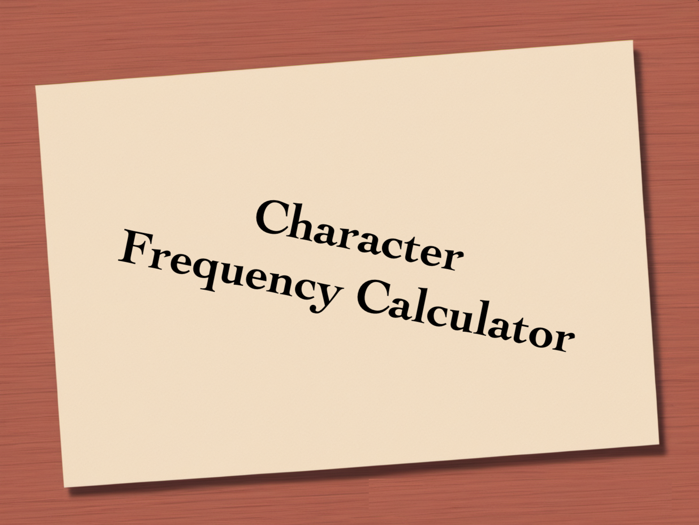

<a name="readme-top"></a>

<!-- PROJECT SHIELDS -->
<div align="center">
  
  
  
  
</div>

<!-- PROJECT LOGO -->
<br />
<div align="center">
  <a href=" ">
    
  </a>
  <h1 align="center">Character Frequency Calculator</h1>
</div>


<!-- TABLE OF CONTENTS -->
<details>
  <summary>Table of Contents</summary>
  <ol>
    <li>
      <a href="#about-the-project">About The Project</a>
      <ul>
        <li><a href="#built-with">Built With</a></li>
      </ul>
    </li>
    <li>
      <a href="#getting-started">Getting Started</a>
      <ul>
        <li><a href="#prerequisites">Prerequisites</a></li>
        <li><a href="#installation">Installation</a></li>
      </ul>
    </li>
    <li><a href="#usage">Usage</a></li>
    <li><a href="#contact">Contact</a></li>
</details>


<!-- ABOUT THE PROJECT -->
## About The Project

Welcome to the Character Frequency Calculator, a robust Java-based application designed to compute the frequency of characters in a given input string. This project encompasses various components to ensure efficient character frequency analysis while maintaining code quality and resilience.
  
<p align="right">(<a href="#readme-top">back to top</a>)</p>

### Built With
* 
* 
* 
* 
* 
* 

<p align="right">(<a href="#readme-top">back to top</a>)</p>

<!-- GETTING STARTED -->
## Getting Started

### Prerequisites
Before you begin, ensure you have the following prerequisites installed on your system:

**Java Development Kit (JDK):** The application is built with Java, so make sure you have the latest JDK installed. 

### Installation
Setting up this app is a simple process. Follow these steps to get your local copy up and running:

1. Clone the repo:
   ```sh
   git clone https://github.com/DrDmlg/char-freq.git
   ```
2. Navigate to the project folder:
   ```sh
   cd char-freq
   ```
3. Build the project:
   ```sh
   gradle build
   ```
4. Run the application:
   ```sh
   java -jar build/libs/char-freq-0.0.1.jar
   ```

6. The application is running!

**The endpoints description is available at http://localhost:8080/swagger-ui.html You can test it using Postman or cURL**

Congratulations! You've successfully installed the Character Frequency Calculator.
<p align="right">(<a href="#readme-top">back to top</a>)</p>

<!-- USAGE EXAMPLES -->
## Usage

Demonstration of a request to the endpoint.

<p align="center"> </p>

<p align="center"> </p>

<p align="center"> </p>

## Example 1. Illustration of what happens if you enter a string ranging from 1 to 100 characters.

**Example of incoming data:**
```json
{
    "input" : "The sun shines bright, flowers bloom."
}
```

**Example of output  data:**

```json
{
    " ": 5,
    "s": 4,
    "e": 3,
    "h": 3,
    "o": 3,
    "b": 2,
    "i": 2,
    "l": 2,
    "n": 2,
    "r": 2,
    "f": 1,
    "g": 1,
    ",": 1,
    "m": 1,
    ".": 1,
    "t": 1,
    "T": 1,
    "u": 1,
    "w": 1
}
```
## Example 2. Illustration of what happens if you enter a string exceeding 100 characters.

**Example of incoming data:**
```json
{
    "input" : "Explore diverse topics, cultivate new skills, and embrace continuous learning for personal and professional development."
}
```

**Example of output  data:**

```json
{
    "violations": [
        {
            "fieldName": "input",
            "message": "The length of the input string must be at least 1 and not exceed 100 characters"
        }
    ]
}
```

## Example 3. Illustration of what happens if you enter an empty string.

**Example of incoming data:**
```json
{
    "input" : ""
}
```

**Example of output  data:**

```json
{
    "violations": [
        {
            "fieldName": "input",
            "message": "The input string cannot be empty or contain only spaces"
        }
    ]
}
```
<hr>

<p align="right">(<a href="#readme-top">back to top</a>)</p>


<!-- CONTACT -->
## Contact

D. Dmitry - [Linkedin](https://www.linkedin.com/in/dmitry-dorokhov/) - dorokhov.did@gmail.com

Project Link: [https://github.com/DrDmlg/char-freq](https://github.com/DrDmlg/char-freq)

<p align="right">(<a href="#readme-top">back to top</a>)</p>
